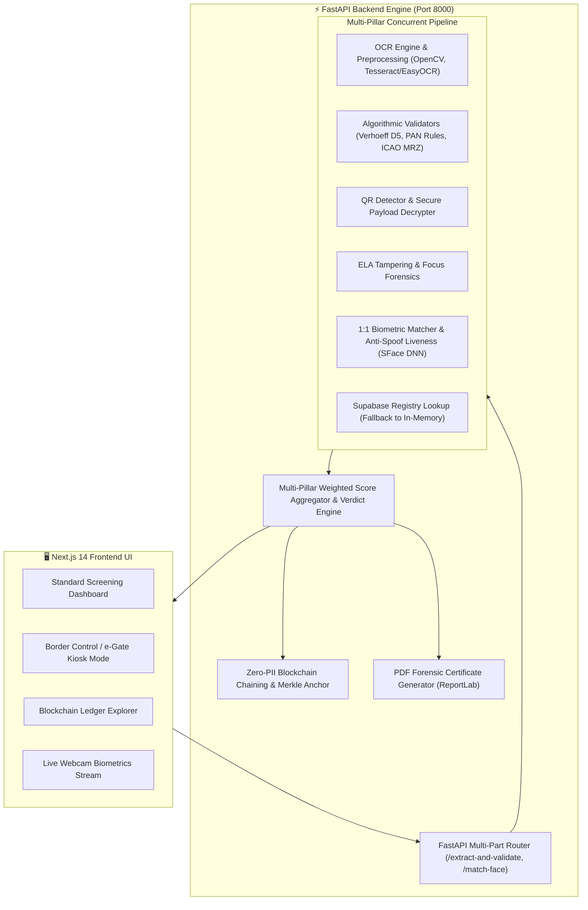

<div align="center">

# 🛡️ Sentinel — AI-Powered Fake Identity & Document Screening System
### Smart India Hackathon (SIH) 2026 — Problem Statement 26188
**Organization:** Ministry of Home Affairs (MHA) | **Domain:** Border Control, Law Enforcement & eKYC Security

[](https://fastapi.tiangolo.com)
[](https://nextjs.org/)
[](https://www.typescriptlang.org/)
[](https://www.python.org/)
[](https://tailwindcss.com/)
[](https://opencv.org/)
[](https://supabase.com/)
[](https://polygon.technology/)

<p align="center">
  <b>An end-to-end, multi-modal forensic inspection, algorithmic validation, and 1:1 live biometric verification engine engineered for instant fraud detection and tamper-evident audit logging.</b>
</p>

[Key Features](#-key-features) • [Architecture](#-system-architecture) • [Multi-Pillar Verification](#-7-pillar-fraud-detection-engine) • [Quick Start](#-quick-start-guide) • [API Reference](#-api-reference) • [Blockchain Audit Ledger](#-immutable-blockchain-audit-ledger) • [Testing](#-testing--validation)

---

</div>

## 📌 Problem Overview & Objective

Identity document forgery—including counterfeit Aadhaar cards, fabricated PAN cards, manipulated Passports (MRZ), and forged Driving Licenses—poses serious national security, border control, and financial fraud risks.

This solution provides a **real-time, zero-trust document screening platform** that evaluates uploaded or scanned identity credentials across **7 independent verification pillars**, combines them into a weighted composite **Authenticity Score (0–100%)**, performs **1:1 biometric facial verification with anti-spoofing liveness checks**, anchors verdicts to a **tamper-proof blockchain ledger**, and generates official **PDF Forensic Audit Certificates**.

---

## ✨ Key Features

- 📑 **Universal Document Parsing:** Ingests and processes Indian Aadhaar Cards, PAN Cards, Passports (ICAO 9303 TD3 MRZ), and Driving Licenses.
- 🧮 **Algorithmic Checksum Validation:**
  - **Aadhaar:** 12-digit Verhoeff Dihedral Group ($D_5$) multiplication/permutation checksum calculation & invalid prefix checks.
  - **PAN:** Income Tax Dept syntax rules (`[A-Z]{5}[0-9]{4}[A-Z]`), 4th character entity type validation, and 5th character surname correlation.
  - **Passport:** Full ICAO 9303 Machine Readable Zone (MRZ) parser with 7-3-1 weighted check digits for document number, birth date, expiration date, and composite checksum.
- 🔍 **Digital Forensics & ELA:** Error Level Analysis (ELA) for image compression anomalies and splicing detection, plus Laplacian variance sharpness and lighting uniformity tests.
- 📱 **QR Code Payload Cross-Check:** Detects QR codes (including UIDAI Secure Aadhaar QR), decodes embedded cryptographic/plain payloads, and cross-verifies against OCR text to flag fraudulent overlays.
- 👤 **1:1 Live Biometric Face Matching & Anti-Spoofing:**
  - Deep 128-D facial feature embeddings (SFace) with Cosine Similarity and Euclidean distance metrics.
  - Passive anti-spoofing and liveness detection (texture variance, frequency spectrum, screen reflection detection).
  - Dedicated **e-Gate / Border Control Kiosk Mode** with live webcam facial capture.
- 🗄️ **Government Registry Cross-Verification:** Real-time lookup against Supabase PostgreSQL registry with instant fallback to built-in mock registry for offline testing.
- ⛓️ **Zero-PII Blockchain Audit Ledger:** Computes SHA-256 HMAC digests of verdicts, organizes transactions into Merkle trees, and chains them into an immutable ledger with independent verification endpoints.
- 📄 **Forensic PDF Audit Report Generator:** Instant generation of downloadable, cryptographically signed audit certificates with QR verification links.

---

## 🏗️ System Architecture



---

## 🔬 7-Pillar Fraud Detection Engine

| # | Pillar | Description | Tech / Algorithm |
|---|---|---|---|
| **1** | **OCR & Structural Layout** | Adaptive Gaussian thresholding, grayscale deskew, regex entity parsing (Name, DOB, ID, Gender, Father's Name). | OpenCV, Tesseract, EasyOCR |
| **2** | **Algorithmic Checksums** | Mathematical check digit calculation ensuring ID numbers are legally issued and un-tampered. | Verhoeff $D_5$, PAN IT Rules, ICAO 9303 7-3-1 MRZ |
| **3** | **Digital QR Cross-Check** | Extracts QR payload and cross-references against OCR text to catch photo/text replacements. | OpenCV QRCodeDetector, pyzbar, UIDAI parser |
| **4** | **Error Level Analysis (ELA)** | Computes compression error variance across image regions to detect copy-paste spliced text or stamps. | PIL, NumPy, ELA Matrix |
| **5** | **Substrate & Focus Quality** | Evaluates Laplacian variance and illumination balance to detect intentional blur or screen re-captures. | Laplacian Kernel, OpenCV |
| **6** | **Government Registry Lookup** | Cross-checks ID numbers against active national database records for `AUTHENTIC`, `REVOKED`, or `EXPIRED` status. | Supabase PostgreSQL / Mock DB |
| **7** | **1:1 Live Biometric Matching** | Extracts facial portrait from document, detects live face, checks liveness, and computes 128-D cosine distance. | SFace Deep CNN, YuNet, Anti-Spoofing |

---

## 📂 Repository Structure

```
sih26188/
├── app/                          # Next.js 14 App Router (Frontend)
│   ├── globals.css               # Cyber-defense custom styling & animations
│   ├── layout.tsx                # Root HTML & Metadata layout
│   └── page.tsx                  # Full interactive screening dashboard & e-Gate kiosk
├── backend/                      # FastAPI Python Backend
│   ├── blockchain_ledger.py      # Cryptographic zero-PII ledger & Merkle chaining
│   ├── db.py                     # Supabase DB client & in-memory fallback registry
│   ├── face_matcher.py           # SFace 128-D facial embeddings & liveness anti-spoof
│   ├── forensics.py              # Error Level Analysis (ELA) & blur/sharpness metrics
│   ├── main.py                   # FastAPI REST API application & route handlers
│   ├── models.py                 # Pydantic data schemas & response models
│   ├── ocr.py                    # OpenCV image preprocessing, OCR & QR decoders
│   ├── report_generator.py       # ReportLab PDF audit certificate generator
│   ├── requirements.txt          # Python dependencies
│   ├── seed_data.py              # Supabase sample database seeder
│   ├── supabase_schema.sql       # PostgreSQL database schema & DDL
│   ├── test_api.py               # Comprehensive unit & algorithmic test suite
│   ├── test_endpoint.py          # HTTP endpoint test client
│   ├── test_face_match.py        # 1:1 facial biometric test suite
│   ├── validators.py             # Verhoeff, PAN, ICAO MRZ, and DL validators
│   ├── Dockerfile                # Docker containerization for backend
│   └── .env.example              # Environment variable template
├── package.json                  # Next.js frontend package manifest
├── tailwind.config.js            # Tailwind CSS design tokens
├── tsconfig.json                 # TypeScript compiler configuration
└── README.md                     # Comprehensive project documentation
```

---

## ⚡ Quick Start Guide

### Prerequisites

Ensure you have the following installed on your machine:
- **Node.js**: v18.0 or higher
- **Python**: v3.10 or higher
- **Tesseract OCR**:
  - **Ubuntu / Debian:** `sudo apt install tesseract-ocr`
  - **macOS:** `brew install tesseract`
  - **Windows:** [UB-Mannheim Tesseract Installer](https://github.com/UB-Mannheim/tesseract/wiki)

---

### 1. Backend Setup (FastAPI)

```bash
# Navigate to backend directory
cd backend

# Create and activate Python virtual environment
python -m venv venv

# On macOS/Linux:
source venv/bin/activate
# On Windows (PowerShell):
.\venv\Scripts\Activate.ps1
# On Windows (Command Prompt):
.\venv\Scripts\activate.bat

# Install dependencies
pip install -r requirements.txt

# (Optional) Setup environment variables
cp .env.example .env

# Start FastAPI server with live reload
uvicorn main:app --reload --port 8000
```

The backend server will run at: **`http://localhost:8000`**  
Interactive Swagger API documentation: **`http://localhost:8000/docs`**

---

### 2. Frontend Setup (Next.js 14)

Open a new terminal in the repository root:

```bash
# Install NPM dependencies
npm install

# Start development server
npm run dev
```

Open your browser at: **`http://localhost:3000`**

---

## 🔌 API Reference

### 1. `POST /extract-and-validate`
Ingests an identity document image scan (and optional live face image), runs all 7 verification checks concurrently, anchors verdict to blockchain, and returns full telemetry.

**Request:** `multipart/form-data`
- `file` *(required)*: Binary image (JPEG/PNG) of Aadhaar, PAN, Passport, or DL.
- `live_face` *(optional)*: Binary image of passenger's live camera capture for biometric matching.

**Sample Response:**
```json
{
  "success": true,
  "document_type": "AADHAAR",
  "verdict": "AUTHENTIC",
  "authenticity_score": 96,
  "confidence": 0.96,
  "processing_time_ms": 142.5,
  "checksum_result": {
    "algorithm": "Verhoeff Dihedral Group (D5)",
    "passed": true,
    "details": "12-digit Verhoeff checksum verified successfully.",
    "raw_extracted": "367598341238"
  },
  "cross_check_result": {
    "passed": true,
    "status": "AUTHENTIC",
    "name_matched": true,
    "source": "SUPABASE_DB"
  },
  "blockchain_anchor": {
    "verdict_hash": "0xa4f28c1...",
    "tx_hash": "0x89d2...",
    "block_number": 1042,
    "network": "Polygon PoS (Amoy Testnet - EVM)",
    "merkle_root": "0x3e18..."
  },
  "validation_checks": [ ... ],
  "extracted_fields": [ ... ]
}
```

---

### 2. `POST /match-face`
Dedicated 1:1 facial biometric matching endpoint with anti-spoofing liveness analysis.

**Request:** `multipart/form-data`
- `document_image`: Document scan with facial portrait.
- `live_face_image`: Live camera frame.

**Sample Response:**
```json
{
  "success": true,
  "verdict": "MATCH",
  "is_match": true,
  "match_score": 94,
  "cosine_similarity": 0.942,
  "liveness_score": 98,
  "liveness_status": "GENUINE_LIVE_PERSON",
  "is_live_person": true,
  "verdict_description": "Biometric match confirmed with genuine live person presentation."
}
```

---

### 3. `GET /verify-blockchain-anchor/{identifier}`
Independent 3rd-party audit endpoint to verify transaction hash, block number, or verdict hash on the immutable ledger.

---

### 4. `POST /generate-audit-report`
Generates an official, timestamped PDF forensic certificate containing the complete screening breakdown, verification seals, and cryptographic hashes.

---

## ⛓️ Immutable Blockchain Audit Ledger

To satisfy stringent legal and evidentiary standards for government and border control applications, all screening verdicts are cryptographically anchored:

1. **Zero-PII Guarantee:** Plaintext names, Aadhaar numbers, and biometric face crops are **NEVER** stored on the ledger.
2. **Deterministic SHA-256 Digest:** A normalized payload containing document type, salted ID digest, verdict, timestamp, and score is hashed:
   $$\text{Verdict Digest} = \text{HMAC-SHA256}(\text{DocType} \parallel \text{SaltedID} \parallel \text{Verdict} \parallel \text{Score}, K_{\text{audit}})$$
3. **Merkle Chaining:** Transactions are bundled into Merkle trees and chained sequentially with the previous block's hash.
4. **Independent Verifiability:** Anyone with the transaction hash or audit certificate can independently verify that the screening verdict was not modified after issuance.

---

## 🧪 Testing & Validation

Run the automated test suites in the `backend/` directory:

```bash
cd backend
source venv/bin/activate

# 1. Run algorithmic checksum & rule tests (Verhoeff, PAN, Passport MRZ)
python test_api.py

# 2. Run 1:1 Biometric matching and liveness tests
python test_face_match.py

# 3. Test HTTP endpoints
python test_endpoint.py
```

---

## 🐳 Docker Deployment

You can deploy the backend as a containerized microservice:

```bash
cd backend

# Build Docker image
docker build -t sih26188-backend:latest .

# Run container
docker run -d -p 8000:8000 --name sih26188-api sih26188-backend:latest
```

---

## 🛡️ Security & Privacy Compliance

- **Zero Data Retention Policy:** Scanned images and live webcam streams are processed strictly in-memory (RAM) and immediately garbage-collected after verification.
- **UIDAI & IT Act Compliance:** No Aadhaar numbers are anchored in plaintext; cryptographic one-way HMAC hashing is used for audit trails.
- **Offline Resiliency:** Fully operational in air-gapped environments with the local mock registry and embedded deep learning models.

---

## 👥 Team & Acknowledgements

Developed for **Smart India Hackathon (SIH) — Problem Statement 26188 (MHA)**.  
Designed to protect national borders, secure digital identity infrastructure, and combat document forgery using responsible, explainable Artificial Intelligence.
